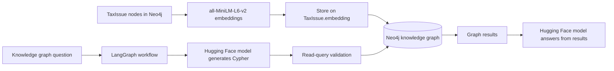

# Litigation GraphRAG

Litigation GraphRAG is a Python prototype for exploring legal cases with a Neo4j knowledge graph. It generates sentence embeddings for tax-issue nodes and stores them in Neo4j alongside legal case data. Natural-language graph questions are handled by LangGraph and a hosted Hugging Face model.

## Architecture



The embedding-generation script stores vectors in Neo4j. The current LangGraph agent retrieves information with generated Cypher; it does not yet query a Neo4j vector index or use the stored embeddings for similarity search.

## Main modules

- `langgraph_agent.py` turns a question into a read-only Cypher query, validates it, queries Neo4j, and generates a grounded answer.
- `kg_agent.py` provides a case-ID lookup flow against Neo4j.
- `embedding/generate_embeddings.py` creates embeddings for `TaxIssue` nodes in Neo4j.
- `embedding_layer.py` and the Qdrant utilities in `embedding/` are separate experiments and are not part of the Neo4j workflow described here.

## Services and credentials

The Neo4j scripts expect a database at `bolt://localhost:7687`. Set `NEO4J_PASSWORD` and `HF_TOKEN` in the environment before running the Neo4j/Hugging Face agents. For example, in PowerShell:

```powershell
$env:NEO4J_PASSWORD = "your_neo4j_password"
$env:HF_TOKEN = "your_hugging_face_token"
python langgraph_agent.py
```

The Cypher validation in `langgraph_agent.py` is a basic guardrail, not a substitute for a read-only Neo4j database account or production-grade query controls. This project provides legal information, not legal advice.