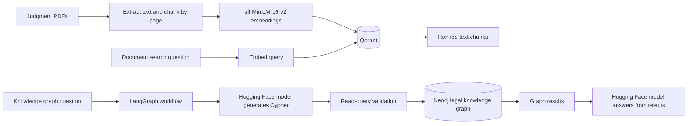

# Litigation GraphRAG

Litigation GraphRAG is a Python prototype for exploring legal cases with semantic document search and a Neo4j knowledge graph. The current codebase contains two separate retrieval paths: PDF search backed by Qdrant, and natural-language graph questions handled by LangGraph and a hosted Hugging Face model.

## Architecture



The document and graph paths are currently independent; the scripts do not yet combine vector matches with graph results in one workflow.

## Main modules

- `embedding_layer.py` extracts PDF text, creates overlapping chunks, indexes them in Qdrant, and runs semantic search.
- `langgraph_agent.py` turns a question into a read-only Cypher query, validates it, queries Neo4j, and generates a grounded answer.
- `kg_agent.py` provides a case-ID lookup flow against Neo4j.
- `embedding/generate_embeddings.py` creates embeddings for `TaxIssue` nodes in Neo4j.
- `embedding/` contains Qdrant setup, sample document insertion, and a standalone semantic search example.

## Services and credentials

The scripts expect Neo4j at `bolt://localhost:7687` and Qdrant at `http://127.0.0.1:6333`. Set `NEO4J_PASSWORD` and `HF_TOKEN` in the environment before running the Neo4j/Hugging Face agents. For example, in PowerShell:

```powershell
$env:NEO4J_PASSWORD = "your_neo4j_password"
$env:HF_TOKEN = "your_hugging_face_token"
python langgraph_agent.py
```

The PDF indexing script reads local PDF files from `documents/`; PDFs are intentionally excluded from version control. Only run it against a disposable or backed-up Qdrant collection: it deletes and recreates the `litigation_documents` collection before indexing.

The Cypher validation in `langgraph_agent.py` is a basic guardrail, not a substitute for a read-only Neo4j database account or production-grade query controls. This project provides legal information, not legal advice.