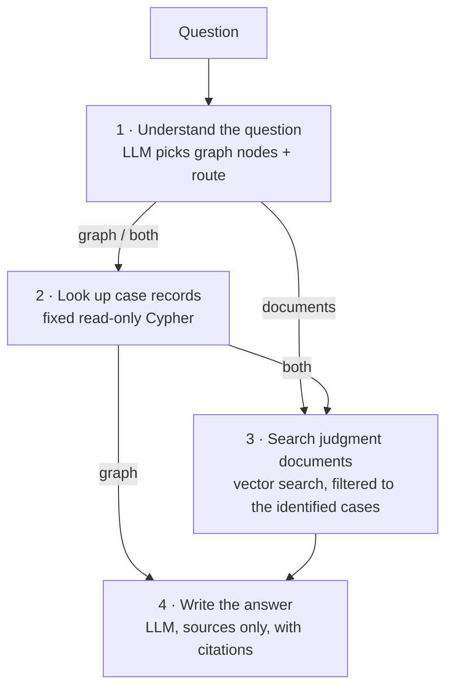

# Litigation AI Assistant (GraphRAG)

Ask questions about tax litigation cases in plain English and get answers
that cite where every fact came from.

The assistant combines two sources, both stored in one Neo4j database:

- **Case records** in a knowledge graph: companies, cases, tax issues, legal
  sections, courts, tribunals, lawyers, judgments and related cases.
- **Judgment documents**: the full text of the judgment PDFs, split into
  passages and indexed by meaning (vector search).

An LLM decides which source a question needs, the relevant facts and
passages are retrieved, and the LLM writes an answer **only** from them, with
a citation after each statement.

> The case data and judgments in this repository are synthetic test data.
> The assistant provides legal information, not legal advice.

---

## Example

```text
Ask a question › Who represented ABC Ltd and what was the court's judgement?

  ✓  Understood the question  → Case records + judgment text · 1 case(s) identified
  ✓  Looked up case records  → CASE001
  ✓  Searched judgment documents  → 2 relevant passage(s)
  ✓  Wrote the answer

┌─ Answer ─────────────────────────────────────────────────────────────┐
│  ABC Ltd was represented by Raj Sharma [Knowledge Graph]. The appeal │
│  was allowed on 2024-08-15 [Knowledge Graph], and the disallowance   │
│  of the disputed expenditure was set aside [CASE001, DOC001, page 4].│
└──────────────────────────────────────────────────────────────────────┘

──────────────────────── How this answer was found ────────────────────────
  Approach: Case records + judgment text
  Cases identified · Case record · Supporting passages (file, page, relevance)
```

Simple factual questions skip the document search, and questions about
arguments or evidence skip the case records. The output shows which steps
ran and which were skipped.

---

## How it works



1. **Understand the question.** The LLM gets the list of graph nodes and
   picks the ones the question refers to, plus a **route**:
   - `graph`: structured facts only (who, which court, outcome, date)
   - `documents`: judgment contents only (arguments, evidence, reasoning)
   - `both`: needs both, or unsure. This is also the fallback.

   Nodes whose name appears word for word in the question are added even if
   the LLM missed them. If no node matches, the cases with the semantically
   closest passages are used instead.
2. **Look up case records** for those cases with fixed, read-only Cypher
   queries. The LLM never writes database queries.
3. **Search the judgment documents** of those cases only, so passages from
   unrelated cases can't crowd out the right ones.
4. **Write the answer** from the retrieved facts and passages only, citing
   `[Knowledge Graph]` or `[CASE…, DOC…, page N]` after each statement.

The workflow is a [LangGraph](https://github.com/langchain-ai/langgraph)
state graph. See [GRAPHRAG.md](GRAPHRAG.md) for the full technical
walk-through: graph schema, chunking, the Cypher and vector queries,
and the prompts.

### Technology

| Part | Choice |
|---|---|
| Database (graph + vectors) | Neo4j 5.18+ with a vector index |
| Embeddings | `BAAI/bge-small-en-v1.5` (384 dimensions), run locally |
| LLM | `qwen/qwen3.8-27b` through the Groq API (OpenAI-compatible) |
| Orchestration | LangGraph |
| Terminal UI | Rich |

---

## Getting started

### Prerequisites

- Python 3.12
- Neo4j 5.18 or later running at `bolt://localhost:7687`, with the case
  knowledge graph loaded (schema in [GRAPHRAG.md](GRAPHRAG.md#knowledge-graph-neo4j))
- A Groq API key. The free tier is enough: [console.groq.com](https://console.groq.com)
- The judgment PDFs in `documents/`. PDFs are not committed; `documents/metadata.json`
  maps each file to its case. `python evaluation/make_case003_pdf.py`
  regenerates the synthetic CASE003 judgment.

### 1. Install

```powershell
python -m venv .venv312
.venv312\Scripts\activate
pip install -r requirements.txt
```

### 2. Configure

Create a `.env` file in the project root. It is in `.gitignore`, so it is
never committed.

```
NEO4J_PASSWORD=your_neo4j_password
GROQ_API_KEY=your_groq_key
# Optional, these are the defaults:
# NEO4J_URI=bolt://localhost:7687
# NEO4J_USERNAME=neo4j
```

### 3. Ingest the judgments (one time)

Splits the PDFs into passages, embeds them and stores them in Neo4j next to
the graph. Re-run it only when the PDFs or the embedding settings change.

```powershell
python embedding_layer.py ingest
```

### 4. Ask questions

```powershell
python main.py
```

Type a question, or:

| Command | What it does |
|---|---|
| `help` | Lists sample questions; type a number to ask one |
| `about` | Explains how the system works, in plain language |
| `exit` | Quits (a blank line also quits) |

A single question also works: `python main.py "Which cases concern Section 32?"`

For the raw technical output (node IDs, routes, chunk scores), run
`python graphrag_agent.py` instead.

---

## Project layout

```
main.py               Presentation front end: live progress, answer first, sources after
graphrag_agent.py     LangGraph workflow: identify nodes → graph context → documents → answer
graph_layer.py        Read-only Neo4j queries for case records; loads .env
embedding_layer.py    CLI for the embedding layer: ingest, search, compare
embedding/store.py    PDF chunking, embeddings, Neo4j vector index and search
documents/            Judgment PDFs (not committed) and metadata.json
evaluation/           Retrieval test queries, experiment results, synthetic PDF generator
GRAPHRAG.md           Full technical documentation
```

## Other embedding-layer commands

```powershell
# Search the judgments directly
python embedding_layer.py search "What evidence did ABC Ltd provide?"
python embedding_layer.py search "court reasoning" --case-id CASE001

# Compare embedding models / chunk sizes for a query (in memory)
python embedding_layer.py compare "What evidence did ABC Ltd provide?"

# Re-ingest with another model; the vector size changes, so recreate the index
python embedding_layer.py ingest --model bge-base --chunk-size 500 --overlap 50 --recreate
```

If you change the embedding model or chunk settings, also update
`EMBEDDING_CONFIG` in `graphrag_agent.py`, since questions must be embedded
with the same model as the stored passages.

## Evaluation

[evaluation/queries.json](evaluation/queries.json) holds 16 test questions,
each with the case and page that should be retrieved.
[evaluation/results/](evaluation/results/) records experiments comparing
embedding models (MiniLM, BGE) and chunk sizes, using Hit@1, Hit@3, MRR and
how often passages from the wrong case were retrieved.

## Limitations

- The knowledge graph must be loaded into Neo4j separately; this repository
  only reads it.
- One LLM call picks the route. If it misjudges a question as `graph`, the
  judgment text is not searched.
- Groq's free tier is rate-limited; very fast repeated questions may be
  refused briefly.
- The data set is small and synthetic (two judgments). Scores and routing
  have not been tested at production scale.
